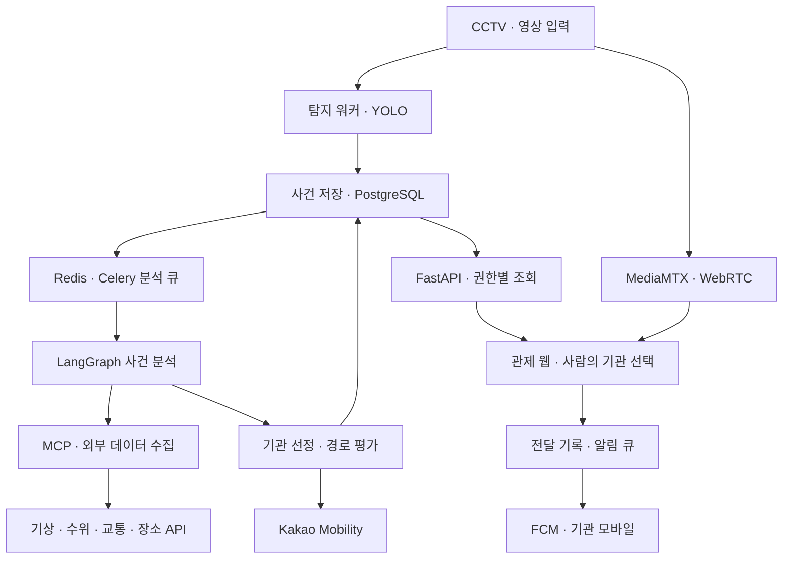
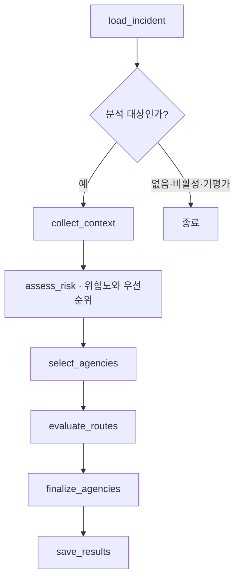

# OCTV · 기술 상세

> CCTV 재난 탐지 이후의 **외부 상황 수집·위험도 판단·대응기관 및 경로 추천·기관 전달**을 연결한 의사결정 지원 시스템입니다.

`KDT 최종 프로젝트` · `2인 팀 · 팀장 이민재` · `2026.09 ~ 2026.11.03` · `최종 발표 완료`

[← 소개와 실제 시연](README.md) · [포트폴리오 목록](../../README.md) · [소스코드 — 비공개·권한 필요](https://github.com/alswo0548/octv)

### 목차

1. [개요와 개발 배경](#1-개요와-개발-배경)
2. [문제와 목표](#2-해결하려는-문제와-목표)
3. [기간·역할](#3-기간--인원--담당-역할)
4. [기술 선택](#4-기술-스택과-선정-이유)
5. [아키텍처](#5-시스템-아키텍처)
6. [사건 처리 흐름](#6-사건-처리-흐름)
7. [DB와 API](#7-데이터베이스와-api)
8. [핵심 구현](#8-핵심-구현)
9. [문제 해결](#9-기술적-문제와-해결)
10. [검증](#10-테스트와-검증)
11. [배운 점](#11-배운-점과-개선할-부분)
12. [남은 과제](#12-향후-개선-과제)

## 1. 개요와 개발 배경

여러 CCTV의 재난 후보를 사건으로 모으고, 외부 정보와 함께 분석해 관제 요원이 대응 순서와 기관·경로를 선택하도록 돕습니다. 영상에서 재난을 찾는 기능뿐 아니라 **탐지 이후 판단에 필요한 데이터와 근거를 연결하는 것**에 초점을 맞췄습니다.

개발과 최종 발표는 완료했습니다. 다만 프로젝트 완료가 모든 운영 조건에서의 정확도·가용성 보증을 뜻하지는 않습니다. 기관 전달까지 지원하며 실제 출동 지령, 도착 확인, 현장 대응 완료를 자동화하지 않습니다.

**확인 기준** — 2026-11-04 기준 원본 `main`은 `0af0bc2`(2026-10-31)입니다. 11월 2일 후속 수정 브랜치 `fix/n001-live-startup-retry-20261102`의 `a6cd563`도 함께 검토했습니다. 운영 UI는 11월 3~4일 직접 확인했으나 서버의 배포 커밋은 확인하지 않았습니다. 따라서 후속 브랜치의 코드를 모두 main 또는 운영 서버에 적용된 기능으로 간주하지 않습니다. 원본 README의 초기 스캐폴드 설명보다 실제 구현 파일과 화면을 기준으로 정리했습니다.

## 2. 해결하려는 문제와 목표

| 문제 | 구현 방향 |
|---|---|
| 다수 영상에서 피해 위치·정도를 동시에 파악하기 어려움 | YOLO 탐지·사건 생성·지도와 우선순위 목록 연결 |
| 반복 탐지가 중복 사건으로 쌓임 | 진행 중 사건의 부분 UNIQUE와 UPSERT로 통합 |
| 외부 데이터의 누락·오래된 값·미검증 값을 구분하기 어려움 | 상태·출처·단위·관측 시각을 포함한 ContextSnapshot |
| 기관·경로 선택 근거가 흩어짐 | 위험도, 역할·지역·접근성, 경로 시간·거리를 각각 평가 |
| 외부 API 지연이나 알림 실패가 요청 처리를 막음 | 분석·알림 워커 분리, 락·재시도·결과 저장 |

## 3. 기간 · 인원 · 담당 역할

- **기간**: 2026.09 ~ 2026.11.03, KDT 최종 발표 완료
- **인원**: 2인 / **역할**: 팀장
- **이민재**: 기상·수위·교통 연동, LangGraph 사건 분석, 위험도·우선순위, 대응기관·경로 추천, 기관 전달·FCM, CCTV 환경 적응학습, Docker 배포·서비스 통합
- **팀원**: CCTV 수집·스트리밍·모니터링, YOLO 기반 재난 탐지·사건 생성 중심

사건 저장·조회·권한·판단 큐 기반을 담당하고 팀원의 탐지·사건 생성 흐름과 연결했습니다. 영상 탐지 시스템 전체를 혼자 구현한 것으로 서술하지 않습니다. 적응학습 역할은 별도 학습 환경에서 수행한 작업을 포함합니다. 저장소 `training/train.py`, `training/evaluate.py`는 미구현 진입점이 남아 있어 저장소만으로 학습을 재현할 수 있다는 주장은 하지 않습니다.

## 4. 기술 스택과 선정 이유

| 기술 | 실제 사용 방식·선택 이유 |
|---|---|
| Python · FastAPI · Pydantic | 탐지·분석 코드와 같은 언어로 API를 구성하고 입출력 검증 |
| PostgreSQL · psycopg · Atlas | SQL 제약·트랜잭션·마이그레이션으로 중복과 관계 무결성 관리 |
| Redis · Celery | HTTP 요청과 분석/알림 작업 분리, 중복 실행 락·캐시 |
| LangGraph | 사건 상태를 전달하며 수집·평가·추천·저장 단계를 명시적으로 연결 |
| FastMCP · httpx | 외부 상황 수집을 도구 인터페이스로 제공; 직접 호출 경로도 지원 |
| YOLO · OpenCV | 재난 객체 추론과 영상 프레임 처리 |
| MediaMTX · WebRTC | CCTV 영상 중계·브라우저 모니터링 |
| React · Vite · TypeScript / React Native · Expo | 관제 웹과 기관 모바일 화면 |
| Firebase Admin SDK · FCM | 기관 사용자 기기의 푸시 발송 요청 |
| Docker Compose · Caddy · DigitalOcean | API·워커·DB·스트리밍·웹 서비스를 분리 배포·통합 |

**LangGraph 사용 = LLM 자율 판단은 아닙니다.** 핵심 위험도·기관·경로 점수는 규칙과 API 데이터로 계산합니다. MCP 기본 경로는 `Client(create_server())`로 같은 Python 프로세스 안의 FastMCP 서버를 호출하며, 별도의 원격 MCP 서버로 배포한 구조가 아닙니다.

## 5. 시스템 아키텍처


```mermaid
flowchart TD
    C["CCTV · 영상 입력"] --> D["탐지 워커 · YOLO"]
    D --> I["사건 저장 · PostgreSQL"]
    I --> Q["Redis · Celery 분석 큐"]
    Q --> G["LangGraph 사건 분석"]
    G --> M["MCP · 외부 데이터 수집"]
    M --> E["기상 · 수위 · 교통 · 장소 API"]
    G --> R["기관 선정 · 경로 평가"]
    R --> K["Kakao Mobility"]
    R --> I
    I --> A["FastAPI · 권한별 조회"]
    A --> W["관제 웹 · 사람의 기관 선택"]
    W --> N["전달 기록 · 알림 큐"]
    N --> F["FCM · 기관 모바일"]
    C --> S["MediaMTX · WebRTC"]
    S --> W
```

`deploy/compose.prod.yaml`은 Postgres 17.11, Redis 7, MediaMTX, API, 분석·알림·CCTV 워커, 웹, Caddy를 분리합니다. 무거운 추론이나 외부 API 지연이 API 요청 수명과 직접 묶이지 않게 합니다. 위 그림은 논리적 흐름이며 모든 화살표가 동기 호출을 뜻하지 않습니다.

## 6. 사건 처리 흐름

1. CCTV 수집·모니터링과 YOLO 추론으로 재난 후보를 얻습니다.
2. 후보를 검증하고 진행 중 사건이면 통합하며 탐지 시각·이미지 등을 저장합니다.
3. 저장 이후 분석 요청을 큐에 넣고 워커가 판단 흐름을 실행합니다. 설정으로 분석 실행 여부를 제어합니다.
4. 외부 상황을 수집·검증하고 위험도·우선순위, 대응기관·경로를 계산합니다.
5. 관측 맥락·평가·추천 결과를 저장하고 관제 화면에서 조회합니다.
6. 관제 요원이 기관을 선택해 전달하면 기록과 알림 작업을 처리합니다.

**실제 LangGraph 노드** (`ai/orchestration/pipeline.py`)


```mermaid
flowchart TD
    L["load_incident"] --> V{"분석 대상인가?"}
    V -->|예| C["collect_context"]
    V -->|없음·비활성·기평가| X["종료"]
    C --> A["assess_risk · 위험도와 우선순위"]
    A --> S["select_agencies"]
    S --> R["evaluate_routes"]
    R --> F["finalize_agencies"]
    F --> P["save_results"]
```

총 7개 처리 노드이며 우선순위는 `assess_risk` 안에서 결정합니다. 기본 흐름은 이미 평가된 사건이나 `DETECTED`·`CONFIRMED` 이외 상태 등을 걸러 불필요한 재실행을 피합니다. 외부 상황 수집은 순차 호출이고, 기관별 경로 조회에는 최대 4개 스레드를 사용합니다. 전체 파이프라인이 병렬 수집이라고 설명하지 않습니다.

## 7. 데이터베이스와 API

### 데이터 구조

사건을 중심으로 탐지 이력·외부 상황·평가·기관 추천·후보 경로·전달/알림을 연결합니다. `analysis_storage.py`는 관측 시각을 UTC로 정규화하고 숫자·상태를 검증하며 평가 결과를 트랜잭션으로 저장합니다. 규칙 버전과 출처·결측 정보를 남겨 결과 해석의 근거를 보존합니다.

<details>
<summary>초기 설계 ERD 보기 — 2026-10-02 기준</summary>


초기 13개 테이블 설계 자료입니다. 이후 마이그레이션을 포함한 최종 DB의 전체 스키마와 동일하지 않으며, 현재 스키마는 원본 저장소의 SQL·마이그레이션을 기준으로 합니다.

</details>

| 무결성·조회 규칙 | 목적 |
|---|---|
| 진행 중 사건의 `(cctv_id, hazard_type, dedup_key)` 부분 UNIQUE | 동시 탐지에도 같은 사건 중복 생성 방지 |
| `ON CONFLICT`와 `GREATEST(last_detected_at, …)` | 늦게 도착한 탐지가 최근 시각을 되돌리지 않도록 처리 |
| 사건·기관별 추천 관계와 사용자별 알림 중복 제약 | 재처리 시 중복 추천·알림 억제 |
| 최신 평가 1건을 연결하는 `LEFT JOIN LATERAL` | 평가 이력 때문에 사건 목록이 중복되지 않도록 조회 |

### API와 접근 제어

사건 목록·상세·분석 요청, CCTV 모니터링, 기관 추천·경로·전달, 알림과 지원 요청 영역으로 나뉩니다. 초기 문서의 ‘CCTV·알림 전체 501 예정’ 설명은 현재 구현과 맞지 않아 제거했습니다. 모든 라우트가 완성됐다고 일괄 보증하지는 않습니다.

기관 사용자의 조회 범위는 요청의 `agency_id`가 아니라 로그인 사용자의 소속과 전달 관계로 정합니다. 상세 조회 권한이 없으면 사건 존재 여부를 노출하지 않도록 처리합니다. 관리자의 사건 목록과 기관의 수신 목록은 동일한 공개 데이터가 아닙니다.

## 8. 핵심 구현

### ① 외부 데이터를 값과 상태로 함께 전달

`ai/orchestration/context.py`, `backend/app/integrations/`에서 기상·수위·교통·장소 응답을 출처·단위·관측 시각과 함께 정규화합니다. 정상·결측·오래된 값·오류를 구분하고 유효한 관측값만 점수에 반영합니다.

CCTV 좌표와 기상 격자·수위 관측소·교통 링크의 매핑을 캐시합니다. `cctv_mapping.py`의 좌표 지문으로 매핑 변경을 구분하고 Redis 캐시를 사용합니다. 후보 관측소·교통 링크는 검증된 관측 또는 도로 통제 사실과 다릅니다. 매핑이 없으면 `NO_MAPPING`으로 남깁니다.

필수 필드 기본 설정은 빈 목록이므로 외부 정보가 일부 없더라도 재난 유형의 기본 점수로 분석을 이어갈 수 있습니다. **미수집을 안전·0이라는 관측으로 바꾸지 않는 것**이 핵심입니다.

### ② 위험도와 우선순위

| 구성 | 최대 점수·규칙 |
|---|---|
| 심각도 | 60점; 유형 기본값: 침수 40, 쓰러진 나무 40, 심각한 도로 파손 45, 장애물 30 |
| 주변 영향 | 30점 |
| 악화 요인 | 10점 |
| 전체 | 최대 100점 |
| 우선순위 | 70점 이상 P1 / 40점 이상 P2 / 40점 미만 P3 |

`priority_score`는 위험도 점수와 같습니다. 대기 시간 보너스를 별도로 더하는 알고리즘은 아닙니다. 같은 점수에서는 먼저 탐지된 사건과 ID로 순서를 안정화합니다. 소개 페이지의 85점은 이 규칙의 실측 정확도 증명이 아니라 DEMO 시나리오 출력입니다.

### ③ 기관 선정과 경로 점수는 분리

기관 점수 구성: **역할 40점(기본 30+상황 10) + 지역 40점 + 접근성 20점(시간 15+거리 5)**. 먼저 역할·지역·직선거리로 후보를 좁히고 실제 경로 조회 후 재정렬해 최대 4개 기관을 남깁니다.

기관에서 사건 위치로 향하는 후보 경로는 기관당 최대 3개를 평가합니다. 경로 자체는 별도의 100점 척도입니다.

```text
경로 점수 = 70 / (1 + 소요시간초 / 시간기준초)
          + 30 / (1 + 거리미터 / 거리기준미터)
```

통제 상태가 정상이고 차단 영역의 검증 플래그와 좌표가 확보된 경우에만 Shapely 교차 검사를 이용해 경로 배제 여부를 판단합니다. 누락·오래된 값·불확실한 통제 정보는 `NEEDS_REVIEW`로 유지합니다. 상태는 `VERIFIED`, `NEEDS_REVIEW`, `DISQUALIFIED`로 구분하며 검증된 정보의 범위를 넘어 안전을 보장하지 않습니다. 사건 근처로만 도착하는 대체 경로나 외부 내비의 재계산 결과 역시 별도 확인 대상입니다.

### ④ 분석 워커의 중복·실패 처리

`backend/app/workers.py`는 분석과 알림 큐를 분리합니다. 분석 대상 상태와 기존 평가를 확인하고 Redis 락으로 중복 실행을 억제합니다. 재시도 가능한 HTTP·DB·외부 맥락 오류는 지연 후 다시 처리하며 재시도 중 락을 유지하고 최종 종료 시 해제합니다. 사건 저장과 큐 등록을 분리해 큐 실패가 이미 저장된 사건을 없애지 않도록 합니다.

### ⑤ 기관 전달·FCM 알림

기관 전달 기록과 알림을 저장하고 Firebase Admin SDK를 통해 발송합니다. Redis lease·상태와 중복 방지 키를 이용하며 실패한 기기만 재시도합니다.

- 최대 **총 4회 시도**: 최초 1회 + 재시도 3회
- 유효 시간 30분, 기본 60·120·240초 지수 지연과 jitter, `Retry-After` 반영
- FCM 발송 요청 수락과 실제 기기 수신·읽음·현장 출동은 구분

이 수치들은 알림 재시도 정책이며 MCP나 모든 외부 API에 공통 적용되는 정책이 아닙니다.

## 9. 기술적 문제와 해결

| 문제 | 구현한 처리 | 한계·확인 범위 |
|---|---|---|
| 같은 사건의 반복 탐지·동시 저장 | DB 부분 UNIQUE·UPSERT, 최근 탐지 시각의 단조 갱신 | 탐지 모델의 오탐 자체를 해결하는 장치는 아님 |
| 외부 정보 누락을 정상값처럼 사용할 위험 | 상태·출처·시각 검증, 매핑과 관측을 분리 | 필수 데이터가 없으면 판단의 근거가 제한됨 |
| 기관마다 경로 API를 기다리는 지연 | 기관별 경로 조회 최대 4개 스레드, 결과 검증 후 저장 | 공급자 장애·한도에 영향받음 |
| 실패한 푸시를 전체 재전송할 때의 중복 | 사용자별 알림 제약·Redis lease·실패 기기만 재시도 | 실제 단말 수신 보장과 다름 |
| DEMO MP4 시작·추론 표시 동기화 | 디코딩 준비 후 초기 동기화, HTTP Range 재생과 추론 JSON 표시 분리 | 실제 카메라의 실시간 추론과 시연 재생을 구분해야 함 |
| CCTV 연결 중단·재연결 | WebRTC 재연결과 서버 복구 backoff; 후속 브랜치에 N001 시작 재시도 개선 | 촬영 당시에도 연결 오류 CCTV가 표시됨 |

후속 브랜치에는 N001 실시간 박스 표시 경로와 복구 개선 코드가 있지만, 이번 포트폴리오의 CCTV GIF는 **기존 사전 추론 JSON 표시 장면**입니다. 후속 코드를 근거로 해당 GIF가 실시간 추론임을 주장하지 않습니다.

## 10. 테스트와 검증

**코드 검토**에서는 파이프라인 노드, 점수 규칙, 매핑·정규화, 분석 저장, 워커와 알림 재시도, 배포 구성의 실제 구현을 확인했습니다. 원본 프로젝트 테스트를 이번 포트폴리오 작업에서 실행하거나 운영 데이터에 대한 재분석·발송 테스트를 수행하지 않았습니다. 과거 테스트 개수·통과 결과를 최신 결과처럼 재사용하지 않습니다.

| 항목 | 확인한 내용 | 수행하지 않은 검증 |
|---|---|---|
| CCTV 탐지 | 기존 실제 웹 자료의 영상·박스·신뢰도 변화 | 새 실시간 재난 발생·모델 정확도 측정 |
| 사건 분석 | 11월 4일 저장 사건·대표 이미지·P1·외부 정보·분석 펼치기 | 운영 사건 재생성·강제 재평가 |
| 기관·경로 | 후보 경로 선택·기관 탭 전환·지도·시간·점수 | 실제 주행·출동, 전 구간 통제 검증 |
| 기관 전달 | 기존 추천됨/전달됨 상태 조회 | 새 기관 전달·FCM 발송·모바일 수신 |
| 배포 | Docker 구성과 운영 웹 접근 | 서버 내부 설정·배포 SHA·부하 성능 확인 |

GIF 2·3은 운영 화면의 연속 캡처를 순서대로 변환한 자료입니다. 계정 영역 크롭·대기 단축·색상 최적화만 적용했습니다. 생성 UI나 별도 화면을 이어 붙여 동작을 꾸미지 않았습니다.

## 11. 배운 점과 개선할 부분

탐지 신뢰도와 사건 위험도는 서로 다른 값이며, 높은 점수만 보여주는 것보다 **어떤 자료로 계산했는지와 무엇이 빠졌는지**가 중요했습니다. DB 제약·권한·큐·외부 API·프런트 표시를 함께 맞춰야 분석 결과가 실제 사용 흐름으로 이어졌습니다.

DEMO 데이터는 특히 경계를 명확하게 표시해야 합니다. 운영 화면에서 강수량 카드 `0 mm`와 분석 설명 `30 mm`가 함께 나타났습니다. 후자는 시나리오 문구입니다. 이 포트폴리오에서는 이를 명시했지만 운영 코드의 문구 불일치는 수정하지 않았습니다.

## 12. 향후 개선 과제

아래는 완료 기능과 구분한 후속 과제입니다.

- 시나리오 설명과 실제 관측 카드의 관계를 더 명확히 표시
- 미매핑·오래된 관측·통제 구간 검증을 확대하고 기관별 실제 접근 가능성 평가 보강
- 외부 API 장애와 CCTV 재연결을 포함한 장시간 통합·부하 테스트
- FCM 단말 수신 확인과 기관 사용자 동작을 별도 시험 환경에서 검증
- 별도 적응학습 환경의 데이터·설정·평가 결과를 재현 가능한 학습 진입점으로 정리

<br>

[← 소개와 실제 시연으로](README.md) · [포트폴리오 목록으로](../../README.md)
